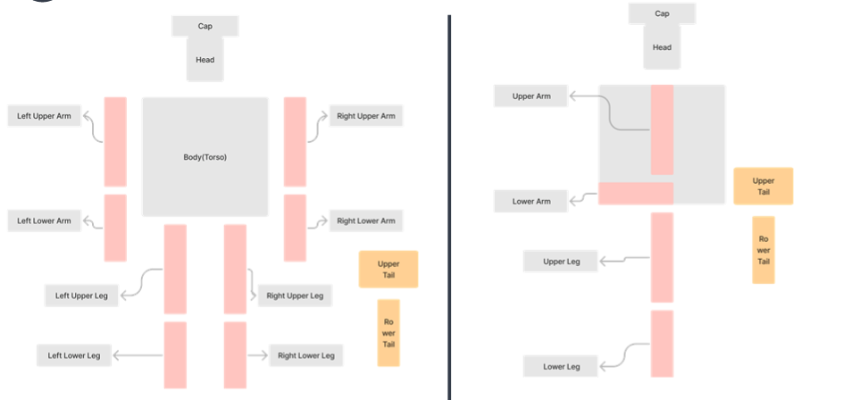
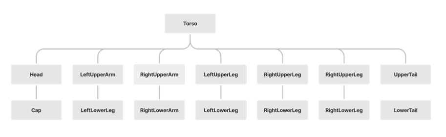

## 1. 요구사항
- `hierarchical model`을 만들어서 움직이게 하기
- `hierarchical model`을 만드는데에는 `matrix stacks`를 사용하기
- 최소 3 level의 모델을 구현하기
- 3차원으로 구현하되 ` polygons, boxes, cylinders, spheres and quadrics`들로 구성하기

## 2. 모델 설명

### 모델 정면도 & 측면도

### 모델 계층도

- 총 13개의 노드로 구성
- Troso는 모델에서 Body역할
-  Upper부분과 Lower부분으로 구성됨

### 결과물
